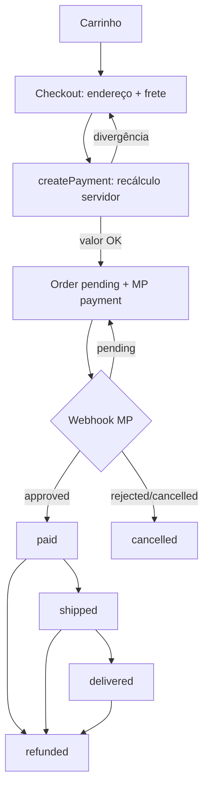
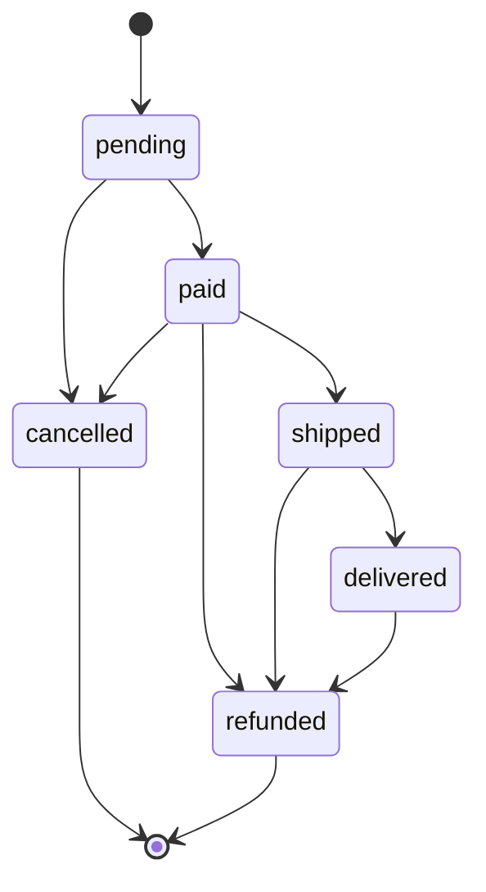
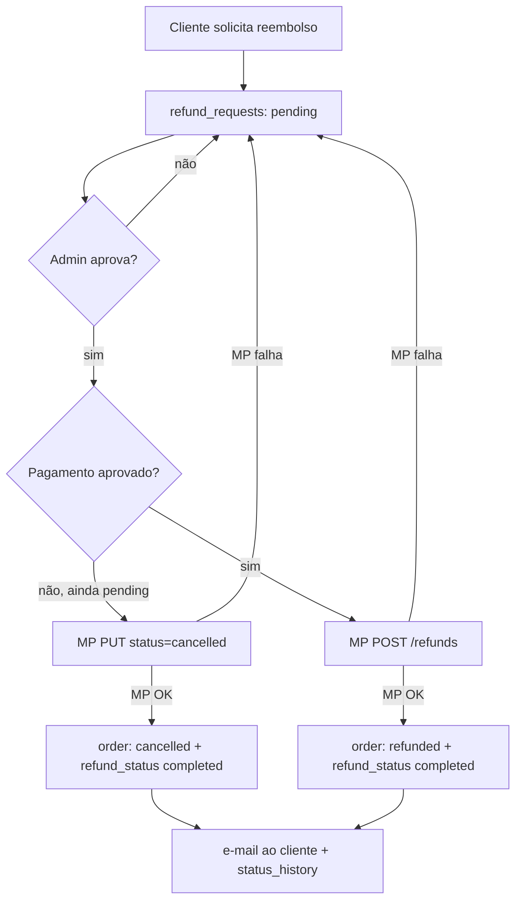

# Auditoria Completa — Fragranciaria

> Data: 2026-07-14 · Stack: TanStack Start + Supabase (Postgres) + Mercado Pago
> Escopo: auditoria operacional de e-commerce (OMS/WMS/fiscal/logística) e
> correções críticas de segurança + fluxo de cancelamento/reembolso.

---

## 1. Resumo executivo

A **visão** do projeto é uma plataforma enterprise (OMS + WMS + fiscal + logística
multi-transportadora). A **realidade** auditada é uma **loja virtual com checkout
funcional** — a maior parte dos 18 domínios pedidos não existe ou é scaffolding.

Três coisas que se assumia funcionarem estavam **quebradas em produção**, e foram
corrigidas nesta sessão:

1. **Preço manipulável no checkout** (cliente podia pagar R$0,01).
2. **Fluxo de reembolso 100% quebrado** (insert em colunas inexistentes).
3. **Webhook do Mercado Pago aceitava qualquer POST** sem segredo configurado.

Além disso, implementou-se o que o dono elegeu como prioridade máxima:
**máquina de estados de pedidos + cancelamento/estorno real no Mercado Pago**.

**Veredito:** a loja vende, mas não estava pronta para operar com volume sem risco
financeiro (preço), fiscal (NF-e falsa) e operacional (sem estoque, sem expedição).
As correções desta sessão fecham os buracos de **perda financeira direta** e dão a
base (máquina de estados) para o resto. NF-e, estoque e expedição seguem como
lacunas maiores, listadas no roadmap.

---

## 2. Arquitetura atual vs. recomendada

### Atual
- **Catálogo**: Supabase `products` (o arquivo estático `src/data/products.ts` é só tipo, dado morto).
- **Pedido**: tabela única `orders`; itens e histórico em colunas JSON
  (`orders.items`, `orders.status_history`) — **não** há `order_items` nem
  `order_status_history` em produção.
- **Pagamento**: Mercado Pago via `/v1/payments` (PIX/cartão/boleto) + webhook.
- **Admin**: server fns com `requireAdmin()` (cookie httpOnly + allowlist `admins`) + service role (bypassa RLS).
- **Frete**: tabela fixa hardcoded (PAC/SEDEX/SEDEX10); Correios/Envio Fácil existem mas **não ligados** ao checkout.

### Recomendada (incremental, sem reescrever)
- Manter `orders` + JSON, mas **centralizar transições** numa máquina de estados (feito: [order-state.ts](../src/lib/order-state.ts)).
- Preço/desconto/frete **sempre recalculados no servidor** (feito para preço).
- Estoque com reserva no checkout + baixa no pagamento (pendente — precisa de tabela/coluna).
- NF-e via **provider** (Focus NFe / PlugNotas / eNotas), nunca SOAP+assinatura própria.
- Notificações por evento numa fila com retry (hoje é síncrono, só e-mail de confirmação).

---

## 3. Achados por severidade

### 🔴 Crítico (P0) — corrigido nesta sessão
| # | Achado | Onde | Status |
|---|--------|------|--------|
| 1 | Valor cobrado vinha do browser sem recálculo | [payments.functions.ts](../src/lib/payments.functions.ts) | ✅ Corrigido |
| 2 | Insert de reembolso em colunas inexistentes (`auth_user_id`/`customer_email`), sem `user_id` (NOT NULL) → todo insert falhava | [refund.functions.ts](../src/lib/refund.functions.ts) | ✅ Corrigido |
| 3 | Webhook MP aceitava qualquer POST se `MP_WEBHOOK_SECRET` ausente | [mp-webhook.ts](../src/routes/api/public/mp-webhook.ts) | ✅ Corrigido (fail-closed em prod) |

### 🟠 Alto
| # | Achado | Onde | Status |
|---|--------|------|--------|
| 4 | Sem máquina de estados — admin gravava qualquer string; webhook atrasado podia regredir pedido | admin + webhook | ✅ Máquina de estados criada e ligada |
| 5 | Reembolso não estornava de verdade no MP | refund flow | ✅ `approveRefund` chama MP (cancel/refund) |
| 6 | **Sem controle de estoque** — nenhum decremento; risco de overselling | — | ⛔ Pendente (precisa migration) |
| 7 | **NF-e não-funcional** — assinatura SHA1 falsa que a SEFAZ rejeita; sem provider; CFOP/NCM/ICMS hardcoded | [nfe.functions.ts](../src/lib/nfe.functions.ts) | ⛔ Pendente (precisa provider) |
| 8 | Queries a tabelas ausentes em `types.ts`: `coupons`, `payment_transactions`, `shipping_quotes`, `shipping_settings`, `nfe_settings`, `product_reviews` | vários | ⚠️ Funciona só se migration aplicada; regenerar types |
| 9 | Sem rate limit em lugar nenhum (login admin brute-forçável) | [admin-auth.ts](../src/lib/admin-auth.ts) | ⛔ Pendente |
| 10 | Webhook WhatsApp sem verificação de assinatura | [whatsapp-webhook.ts](../src/routes/api/public/whatsapp-webhook.ts) | ⛔ Pendente |

### 🟡 Médio
- Cupom validado só client-side (o teto de 30% no servidor mitiga o abuso financeiro, mas a regra do cupom não é reconferida).
- `getMyOrder` lê `order_items`/`order_status_history` (tabelas inexistentes) → detalhe do pedido pode vir vazio ([account.functions.ts](../src/lib/account.functions.ts)).
- Credenciais Correios/SIGEP em texto plano em `shipping_settings`.
- Rastreio sem rate limit (TODO em [order-tracking.functions.ts](../src/lib/order-tracking.functions.ts)).

### 🟢 Baixo / ausente
- Reset de senha do cliente, troca de e-mail, múltiplos endereços, exclusão LGPD — **ausentes**.
- Expedição (picking/packing/conferência/romaneio) — **ausente**.
- Auto-update de rastreio (hoje é botão manual); bulk actions e audit log no admin — **ausentes**.

---

## 4. Fluxograma do ciclo do pedido

## 5. Máquina de estados de pedidos (implementada)

Fonte única: [order-state.ts](../src/lib/order-state.ts). Transições válidas:

`cancelled` e `refunded` são terminais. `canTransition(from,to)` permite
idempotência (`from===to`) para o webhook reentregar sem falhar.

## 6. Máquina de estados de cancelamento/estorno (implementada)

Regra-chave: **o banco só muda depois de o MP confirmar**. Se o MP recusar,
a solicitação continua `pending` e nada é alterado no pedido.

---

## 7. O que foi corrigido nesta sessão

1. **Recálculo de preço no servidor** ([payments.functions.ts](../src/lib/payments.functions.ts)):
   busca preço autoritativo de cada produto no Supabase, valida item ativo, aplica
   frete da tabela fixa e desconto com teto de 30%, e rejeita se o total divergir do
   enviado pelo browser (>R$0,01).
2. **Insert de `refund_requests` corrigido** ([refund.functions.ts](../src/lib/refund.functions.ts)):
   usa `user_id` (schema real), removido cast `as never` morto.
3. **Webhook fail-closed** ([mp-webhook.ts](../src/routes/api/public/mp-webhook.ts)):
   em produção recusa se `MP_WEBHOOK_SECRET` ausente; só ignora em `NODE_ENV=development`.
4. **Máquina de estados** ([order-state.ts](../src/lib/order-state.ts)) ligada no
   `updateOrderForAdmin` (bloqueia saltos/regressões) e no webhook (notificação
   atrasada não regride pedido já avançado).
5. **Estorno real** ([refund.functions.ts](../src/lib/refund.functions.ts) `approveRefund`):
   admin aprova → MP cancela (pendente) ou estorna (aprovado) → pedido vira
   cancelled/refunded → e-mail ao cliente ([email.functions.ts](../src/lib/email.functions.ts) `sendRefundEmail`).

**Migrations:** nenhuma necessária — todas as colunas usadas (`refund_status`,
`status_history`, `refund_requests.*`) já existem em produção.

---

## 8. Funcionalidades ausentes (para operar com volume)

- **Estoque**: reserva no checkout + baixa no pagamento + inventário.
- **NF-e real**: provider (Focus/PlugNotas), CFOP/NCM/CEST corretos, cancelamento, carta de correção.
- **Expedição/WMS**: picking, packing, conferência/bipagem, romaneio, manifesto.
- **Frete real no checkout**: ligar Correios/Envio Fácil (hoje é tabela fixa).
- **Devoluções/trocas**: logística reversa, etiqueta reversa, vale-compra.
- **Conta do cliente**: reset de senha, múltiplos endereços, LGPD.
- **Notificações por evento**: fila + retry; hoje só e-mail de confirmação.
- **Segurança**: rate limit (login/rastreio), assinatura no webhook WhatsApp.

---

## 9. Plano de implementação faseado

### MVP (feito nesta sessão)
- ✅ Preço no servidor, refund insert, webhook fail-closed, máquina de estados, estorno real.

### Curto prazo
- Controle de estoque (reserva + baixa) — desbloqueia reversão de estoque no cancelamento.
- Rate limit no login admin e no rastreio de convidado.
- Regenerar `types.ts` de prod e remover casts `as never`.
- Corrigir `getMyOrder` para ler `orders.items`/`status_history`.

### Médio prazo
- NF-e via provider (Focus/PlugNotas).
- Frete real no checkout (Correios/Envio Fácil).
- Notificações por evento (fila + retry) para envio/entrega/estorno.
- Assinatura no webhook WhatsApp.

### Longo prazo
- Expedição/WMS (picking/packing/conferência/romaneio).
- Devoluções e trocas (logística reversa).
- Conta do cliente completa (senha, endereços, LGPD).
- Painel: bulk actions, audit log, perfis de admin.

---

## 10. Verificação

- `npx tsc --noEmit`: sem erros novos nos arquivos alterados (os erros
  pré-existentes são de tabelas fora dos types — `coupons`/`shipping_*`/`nfe_settings`
  — e somem quando `types.ts` for regenerado).
- Teste manual pendente (precisa de ambiente com MP + Supabase):
  - Preço: adulterar `amount` no body → servidor recobra/rejeita.
  - Refund: solicitar logado → linha criada → aprovar no admin → estorno no MP + e-mail.
  - Estado: tentar transição inválida no admin → rejeitada.
